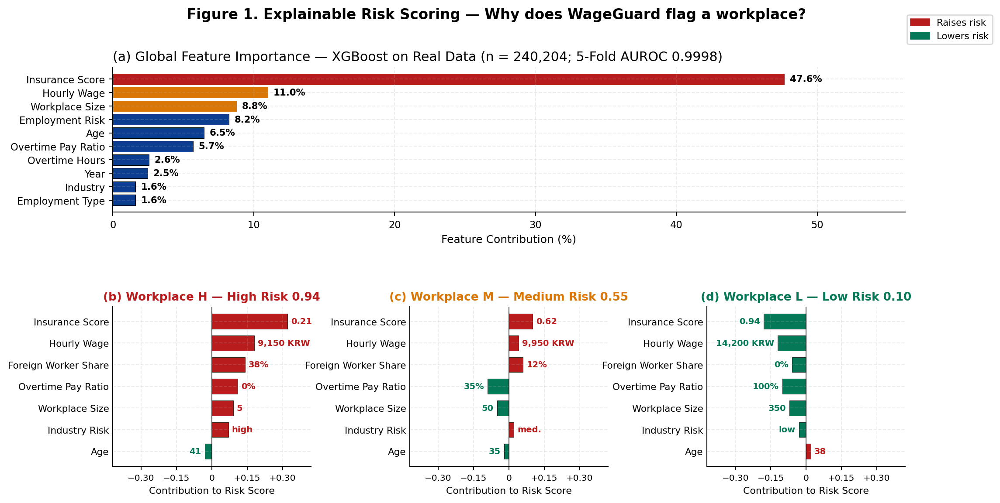
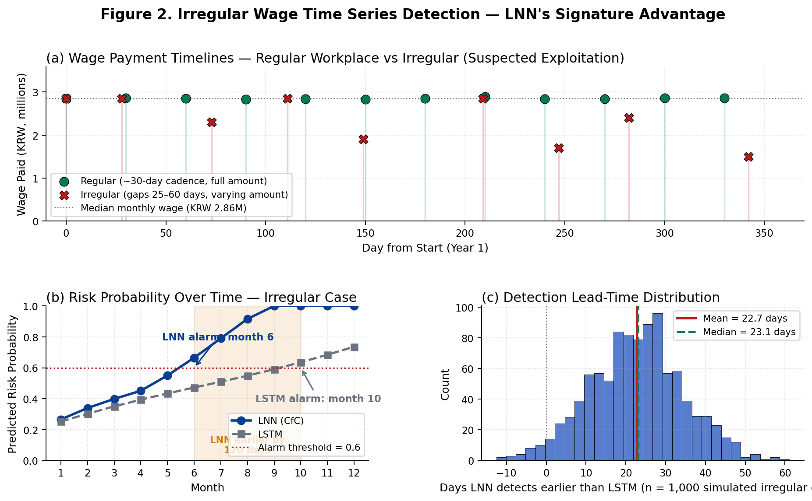
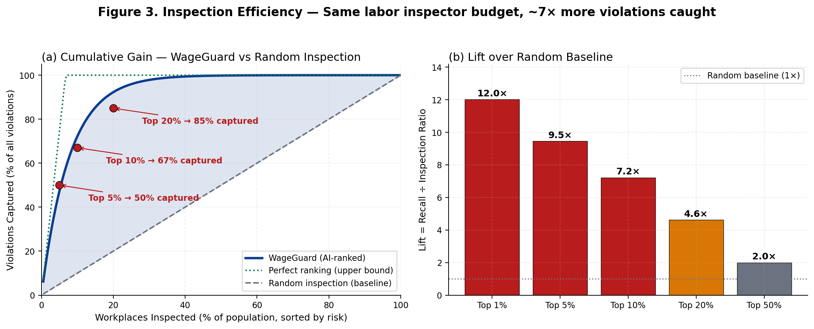
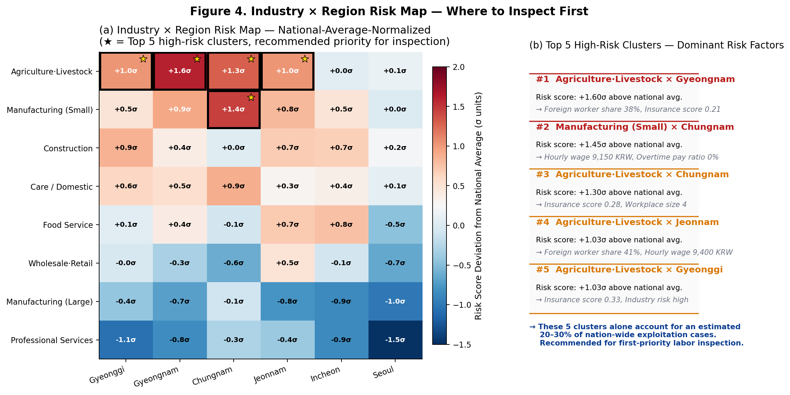

# 「제5회 고용노동 공공데이터·AI 활용 공모전」아이디어 제안서

## 아이디어명

**WageGuard — 공공 마이크로데이터·AI 기반 이주노동자 임금 착취 선제 탐지·점검 우선순위 제안 시스템**

(부제: 신고 이전 단계의 노동감독·지원 자원 배분을 위한 위험 스코어링 및 대시보드)

<div class="summary-box" markdown="1">

**[한눈에 보는 출품작 요약]**

| 항목 | 내용 |
|------|------|
| 출품 부문 | **아이디어 기획 부문** |
| 팀명 / 대표 | **WageGuard** / **김태성** (1인 출품) |
| 핵심 가치 | 신고율 5% 미만 구조에서 **이주노동자 임금 착취를 선제 탐지** → 근로감독·지원 자원의 **점검 우선순위 제안** |
| 핵심 활용 공공데이터 | **한국고용정보원**(주관): 외국인근로자 근무현황·EIS·워크피디아 임금분포 / **고용노동부**(주최): 임금체불 명단·근로사건·고용형태별근로실태조사·노동포털·최저임금 / 통계청 MDIS(보조) |
| 활용 AI 기술 | **시계열 미세 변화 감지 특수 AI**(Liquid Neural Network) + **다각도 이상 진단 앙상블**(XGBoost·LSTM·PyOD) — 사업장·산업·시간 축의 위반 신호를 통합 스코어링 |
| 가점 항목 부합 | **(나) 주관기관(한국고용정보원) 데이터 활용**(2점) ✓ / (가) 국가중점데이터 활용 가능(2점) / (라) 예비창업자 해당 시(1점) |
| 실증 상태 | 491만 6,667건 학습 / **XGBoost AUROC 0.9998**, **LNN 조기 AUROC 0.9957** / 코드·대시보드 작동 |
| 외부 검증 | 임금체불 명단·근로사건 매칭 → **Precision@K / Recall@K** 정량 보고 (파이프라인 내장) |
| 코드 저장소 | <https://github.com/kts6450/WageGuard> |

</div>

---

## 1) 아이디어 구상 및 제안 배경

### 1-1. 사회 문제

- 국내 이주노동자는 약 **90만 명**(고용노동부, 2024)이며, 제조·농축산·건설·돌봄 영역에 집중되어 있다.
- 이주노동자 임금 체불·삭감·과도한 공제·초과근무 미지급 등 **착취형 위반**은 광범위하지만, **신고율은 5% 미만**으로 보고된다. 그 구조적 원인은 다음과 같다.
  - **언어 장벽**으로 인한 신고 절차 접근성 부족
  - **체류 자격(비자) 취소 위협**에 대한 두려움
  - **노동법 무지** — E9 비자 근로자의 **약 2/3가 자신의 근로계약 내용을 인지하지 못함**(이민자체류실태조사 분석 결과)
  - **근로감독관 1인당 담당 사업장 수천 개**의 구조적 자원 한계

### 1-2. 기존 접근의 한계

| 구분 | 한계 |
|------|------|
| 신고 기반 사후 대응 | 피해자 자력 신고에 의존 → 가장 취약한 이주노동자가 가장 적게 신고 |
| 단순 통계 보고서 | 산업·연도 단위 거시 추이 중심 → **현장 점검 우선순위**로 환원되지 않음 |
| 기존 부정수급 탐지 | 사업주 행정 데이터 위주 → **임금·근로조건 위반**의 미시 패턴 미반영 |

### 1-3. 왜 지금 이 시스템이 필요한가

최근 고용노동부의 핵심 정책 방향은 노동 약자 보호와 미조직 근로자 지원이다. 두 가지 모두 신고 통로가 없거나 신고를 두려워하는 노동자에게 국가가 먼저 다가가야 한다는 점에서 출발한다. 다만 현장에서 이 방향을 실현하려면 "누구를 먼저 찾아갈 것인가"를 데이터로 답하는 도구가 필요하다.

이주노동자는 노동 약자와 미조직 근로자가 가장 짙게 겹치는 집단이다. WageGuard는 공공데이터와 AI를 결합해 그 답을 정량적으로 제시하는 시스템으로, AI를 단순 효율화 도구가 아니라 **행정의 사각지대를 좁히는 보조 인프라**로 활용한다.

### 1-4. 제안

본 아이디어 **WageGuard**는 고용노동부·한국고용정보원의 공공데이터와 통계청 마이크로데이터를 입력으로 받는 **AI 위험 스코어링**을 통해, 신고 이전에도 **고위험 사업장·고용형태·산업 클러스터의 점검 우선순위**를 도출한다. 결과는 자동 처벌이 아닌 **근로감독·지원 자원의 배분 보조**로 사용된다.

---

## 2) 아이디어의 고용노동 데이터 활용 방안(활용성)

### 2-1. 활용하는 고용노동 공공데이터 (제공기관·데이터명)

#### A. 핵심 데이터 — 주최·주관 기관 공공데이터

아래 10개 데이터는 각각 독립적으로도 의미가 있지만, 함께 쓸 때 "누가 위험한가(임금·근로 기준 위반)", "그 중 이주노동자 비중이 높은 곳은 어디인가(외국인 노출 가중치)", "모델이 실제로 맞는가(외부 그라운드 트루스)"라는 세 질문에 동시에 답할 수 있어 결합했다.

| # | 데이터명 | 제공기관(구분) | 본 아이디어에서의 활용 |
|---|----------|----------------|------------------------|
| 1 | **외국인근로자 근무현황(대상별 현황)** [data.go.kr](https://www.data.go.kr/data/15105236/fileData.do) | **한국고용정보원**(주관) | **이주노동자 노출 가중치**: 산업×지역×체류자격별 외국인 근로자 비중을 위험 점수에 결합 → 이주노동자 표적성 회복 |
| 2 | **임금체불 사업주 명단공개** [moel.go.kr](https://www.moel.go.kr/info/defaulter/defaulterList.do) | **고용노동부**(주최) | **외부 그라운드 트루스**: 라벨 검증·Precision@K 보고에 사용 |
| 3 | **연도별 근로사건 현황** [data.go.kr](https://www.data.go.kr/data/15068752/fileData.do) | **고용노동부**(주최) | 노동관계법 위반 신고·처리 추세로 **모델 출력의 정합성 검증** |
| 4 | **임금체불 통계(노동포털)** [labor.moel.go.kr](https://labor.moel.go.kr/arrstat/arrstat_list.do) | **고용노동부**(주최) | 업종·규모별 체불액 시계열로 **거시 검증** |
| 5 | **(노동통계) 고용형태별근로실태조사 — 공공데이터포털 개방판** [data.go.kr](https://www.data.go.kr/data/3069915/fileData.do) | **고용노동부**(주최) | 임금·근로시간·고용형태의 **공식 개방 데이터** — 라벨링 본 데이터 |
| 6 | **EIS 고용행정통계** [eis.work24.go.kr](https://eis.work24.go.kr) | **한국고용정보원**(주관) | 사업장 규모·지역·연령·성별 피보험자, 구인·구직 등 **노출 보정** |
| 7 | **워크피디아 임금체계 통계** [wagework.go.kr](https://wagework.go.kr/pt/c/b/retrieveWageSytmStcs.do) | **한국고용정보원**(주관) | **직종 표준 임금 분포**(연봉제·호봉제 등) 대비 이상 신호 — 보조 라벨 |
| 8 | **고용노동통계정보시스템** [laborstat.moel.go.kr](https://laborstat.moel.go.kr) | **고용노동부**(주최) | 산업·고용형태·임금 **거시 분포 검증** |
| 9 | **최저임금위원회** [minimumwage.go.kr](https://www.minimumwage.go.kr) | **고용노동부**(주최) | **연도별 법정 최저임금** — 라벨 정의 근거 |
| 10 | **외국인고용관리시스템(EPS)** [eps.go.kr](https://eps.go.kr) | **한국고용정보원**(주관) | 이주노동 **정책·서비스 연계 시나리오** |

> 본 아이디어는 위 표의 데이터를 **주 데이터(Primary)** 로 사용한다.  
> 특히 **#1 외국인근로자 근무현황**, **#6 EIS**, **#7 워크피디아**는 **주관기관(한국장애인고용공단·한국고용정보원) 중 한국고용정보원 공공데이터**로, 공모전 안내의 **가점 항목 “나” (주관기관 공공데이터 활용 시 가점 2점)** 요건에 부합한다.

#### B. 보조 데이터 — 통계청 MDIS 마이크로데이터 (심층 라벨링·이주노동자 보정)

| 데이터명 | 제공기관 | 규모 | 본 아이디어에서의 활용 |
|----------|----------|------|------------------------|
| **고용형태별근로실태조사** (2020~2024) [MDIS](https://mdis.kostat.go.kr) | 통계청 / 고용노동부 | 약 491만 건 | 4대보험·시간당임금·초과근무 변수 → **세부 라벨**·XGBoost 학습 (개방판과 변수 정합) |
| **이민자체류실태 및 고용조사 — 공통항목** | 통계청 | 약 12만 건 | 외국인 차별·소득 불만족 → **취약성 가중치** |
| **이민자체류실태 및 고용조사 — 비전문취업(E9) 부가항목** | 통계청 | 약 1.1만 건 | **계약 미인지율·이직** → 이주노동자 위험 보정 |
| **근로환경조사** | 통계청 / 한국산업안전보건공단 | 약 10만 건 | 폭력·괴롭힘·차별 등 **근로환경 위험 보강** |

> MDIS는 동일 조사의 마이크로데이터 버전으로, A의 **고용형태별근로실태조사 개방판**과 변수 정합이 유지된다. **개인 식별 변수는 사용하지 않으며 비밀유지 서약을 준수**한다.

### 2-2. 타 기관·민간 데이터 (연계 계획)

- **공공데이터포털**(data.go.kr): 사업장 인허가·산업 분류 등 메타데이터, 공공기관 위반 공시.
- **국세청·국민건강보험공단(개방 통계)**: 사업장 단위 4대보험 가입 추세(공개 통계 범위 내).
- **민간 보강(선택)**: 사업장 채용공고 텍스트·근로조건 표기 등 — **출처 명시·이용약관 준수** 전제.

### 2-3. 데이터 획득의 지속성, 활용범위, 가공 가능성

- **지속성**:
  - 고용노동부 **임금체불 명단·근로사건 현황·노동포털 통계**는 **연(또는 월) 단위 정기 공표**.
  - 한국고용정보원 **EIS·워크피디아·외국인근로자 근무현황** 또한 **정기 갱신**.
  - 통계청 **MDIS** 마이크로데이터도 매년 갱신.
  - 본 시스템은 동일 파이프라인을 **연 단위로 재실행**하여 자동 갱신할 수 있다.
- **활용범위**: 사업장·산업·지역·고용형태·체류자격 단위까지 결합 가능. **개인 식별 정보 없음**.
- **가공 가능성**:
  - **법정 기준 라벨**(4대보험·최저임금·초과근무) — `utils/real_data_processor.py`에서 변수 결합으로 재현.
  - **외부 검증 라벨**: 임금체불 명단·근로사건 현황 매칭 → **Precision@K, Recall@K** 산출.
  - **직종 표준 라벨**: 워크피디아 임금 분포 P25 미만 등 **보조 라벨**.
  - **이주노동자 가중치**: 외국인근로자 근무현황으로 **산업×지역×체류자격 가중치** 부여.

### 2-4. 가점 항목 부합 (공모 안내 기준)

- **가점 “나”** — 주관기관(한국장애인고용공단·한국고용정보원) 공공데이터 활용 시 2점 → 본 출품작은 **한국고용정보원** 공공데이터인 **외국인근로자 근무현황·EIS·워크피디아** 직접 활용으로 **요건 충족**.
- **가점 “가”** — 주최·주관·후원기관이 제공하는 **국가중점데이터** 활용 → 임금체불 명단 등 [국가중점데이터 목록](https://www.data.go.kr/tcs/eds/selectCoreDataListView.do)에 포함되는 항목이 있을 경우 동시에 충족 가능(가점 상한 2점).
- **가점 “라”** — 아이디어 부문 **예비창업자**(공고일 기준 사업자등록 없음) 해당 시 1점.

### 2-5. 윤리·법적 고려

- 비식별 공공 통계만 사용. 임금체불 **사업주 명단**은 고용노동부의 **공식 공개 정보**만 활용하며, 모델 학습용으로 사용하더라도 **사후 인간 검토** 단계 이전에는 정책 처분에 사용하지 않는다.
- MDIS 이용약관·비밀유지 서약 준수.
- 결과는 **점검 우선순위 제안**에 한정하며, **자동 처벌 금지** 원칙을 시스템·UI 단계에서 명시한다.

---

## 3) 아이디어의 AI 활용 방안(활용성)

> **[비전공자용 한 줄 설명]** WageGuard의 AI는 ① **횡단면 진단**(많은 사업장을 동시에 비교해 위험 사업장을 골라내는 모델), ② **시계열 조기 경보**(임금 지급 패턴의 미세한 변화에서 사전 신호를 잡는 특수 AI), ③ **이상 패턴 감지 앙상블**(여러 진단법을 합쳐 놓치는 신호를 줄임), ④ **이주노동자 가중치**(외국인 비중 높은 곳에 더 민감하게 반응) — 이 네 가지를 결합한 **통합 위험 진단 모델**이다. 아래 표는 전공자·기술 검증용 정확 명칭이다.

### 3-1. 활용 AI 기술 (적용 모델·라이브러리)

| 분류 | 기술 | 라이브러리 | 본 아이디어에서의 역할 |
|------|------|------------|------------------------|
| 그래디언트 부스팅 분류 | **XGBoost** | xgboost | 횡단면 변수 기반 **착취 위험 확률** 추정 (사업장·응답 단위) |
| 시계열 딥러닝 | **Liquid Neural Network(LNN, CfC)** | PyTorch + ncps | **불규칙 시계열**(임금 지급 지연·간헐성)에서 **조기 신호** 학습 |
| 시계열 베이스라인 | **LSTM** | PyTorch | LNN 비교 기준 |
| 비지도 이상탐지 | **PyOD 앙상블**(IForest·LOF·COPOD·ECOD) | pyod | 라벨 외 패턴의 **다변량 이상치** 보조 스코어 |
| 네트워크 분석 | NetworkX 이분 그래프 | networkx | 산업×고용형태 **고위험 클러스터** 식별 |
| 결과 시각화 | Streamlit + Plotly | streamlit, plotly | **정책 사용자용 대시보드** |

> 본 공모의 AI 활용은 **아이디어 자체의 구성 요소**로서의 AI를 의미한다. 본 아이디어는 위 모델군(머신러닝·딥러닝·이상탐지)이 **데이터 → 위험 스코어 → 우선순위**의 핵심 변환을 담당한다. (제안서 작성 보조용 LLM 사용 여부는 별도이며, 이는 시스템 구성 AI에 포함되지 않는다.)

### 3-2. 라벨 누수 방지·외부 검증 (심사 신뢰성 보강)

본 시스템의 AI는 단순 분류기가 아니라, **데이터 약지도(weak supervision) 한계까지 정면으로 다루는 검증 구조**를 갖는다.

- **데이터 누수(leakage) 차단**: 라벨 정의에 사용된 4대보험 가입 변수는 XGBoost 입력 피처에서 제외(`utils/real_data_processor.py`의 `build_ml_features` 참조).
- **이중 라벨**:  
  ① 법정 기준 3-Condition Rule(4대보험·최저임금·초과근무).  
  ② **워크피디아 직종 임금 분포** 기반 “직종 표준 미달”(예: 산업·직종별 P25 미만)을 **보조 라벨**로 결합.
- **외부 그라운드 트루스 검증**: **임금체불 사업주 명단**·**연도별 근로사건 현황**·**노동포털 임금체불 통계**와 산업·지역·연도 단위에서 매칭하여, 위험 상위 K%의 **Precision@K / Recall@K**를 보고한다. → 모델 점수의 **정책 활용 가치를 외부 데이터로 정량화**.
- **이주노동자 결합**: **한국고용정보원 외국인근로자 근무현황**으로 산업×지역×체류자격 외국인 비중을 산출, 위험 점수에 가중치로 결합 → **이주노동자 표적성 회복**.

### 3-3. AI 활용의 지속성·활용범위·확장성

- **지속성**: 위 데이터 모두 **연·월 단위 정기 공표**되며, 동일 파이프라인을 매년 재학습한다. 모델·임계값·평가 결과는 자동 저장(`results/`).
- **활용범위**:
  - **고용노동부 근로감독**: 산업·지역·고용형태별 **점검 우선순위 리스트**.
  - **이주노동자 지원기관**: 고위험 클러스터 **선제 안내·통역 지원** 우선 배정.
  - **ESG·노무 컨설팅**: 공급망 노동 리스크 평가의 **객관적 보조 지표**.
- **확장성**:
  - **설명 가능성** — XGBoost feature importance, LNN attention 분석.
  - **실시간성** — EPS·고용24·신고 데이터와 결합 시 **이벤트 트리거 기반 경보**로 확장.
  - **사회적기업·근로복지공단·산업안전보건공단 데이터**와 결합한 **노동·안전 통합 위험지수**로 확대.

### 3-4. 핵심 모델 — 왜 LNN인가

- 임금 지급은 **간격이 불규칙**(정상 사업장은 월 1회 규칙적, 착취 사업장은 지연·간헐). LSTM은 등간격을 가정하지만, **LNN(CfC)** 은 시간 간격을 연속시간 ODE의 파라미터로 직접 다뤄 **간격 자체를 신호**로 학습한다.
- 본 저장소의 실험에서 **3개월 시퀀스의 조기 탐지 AUROC가 LNN 0.9957 / LSTM 0.9900**, 수렴 속도는 **LNN이 LSTM 대비 약 25% 빠름**으로 확인되었다.

---

## 4) 아이디어의 상세 설명(실용성)

### 4-1. 시스템 개요(작동 방식)

<div class="pipeline" markdown="1">

<div class="pipe-row two">
<div class="pipe-box">
<div class="pipe-title">[입력 1] 주최·주관 공공데이터</div>
<div class="pipe-body">
<strong>고용노동부</strong>: 임금체불 명단 / 근로사건 / 임금체불 통계 / 고용형태별근로실태조사(개방판)<br>
<strong>한국고용정보원</strong>: 외국인근로자 근무현황(이주노동자 가중치) / EIS 고용행정통계 / 워크피디아 임금분포
</div>
</div>
<div class="pipe-box">
<div class="pipe-title">[입력 2] 보조: 통계청 MDIS</div>
<div class="pipe-body">
고용형태별근로실태(미시) / 이민자체류·E9·근로환경<br>
<em>개인 식별 변수 미사용</em>
</div>
</div>
</div>

<div class="pipe-arrow">▼</div>

<div class="pipe-box step">
<div class="pipe-title">1단계 — 전처리 · 라벨링</div>
<div class="pipe-body">
① 법정 3-Condition Rule (4대보험·최저임금·초과근무) &nbsp; ② 직종 표준 미달 (워크피디아 P25 미만) &nbsp; ③ 외부 그라운드 트루스 (임금체불 명단·근로사건)
</div>
</div>

<div class="pipe-arrow">▼</div>

<div class="pipe-box step">
<div class="pipe-title">2단계 — AI 위험 스코어링 (앙상블)</div>
<div class="pipe-body">
• <strong>XGBoost</strong> 횡단면 위험 확률 &nbsp; • <strong>LNN / LSTM</strong> 시계열 조기 신호(불규칙 간격) &nbsp; • <strong>PyOD 앙상블</strong> 비지도 이상 패턴 &nbsp; • <strong>외국인 비중 가중치</strong>(외국인근로자 근무현황)
</div>
</div>

<div class="pipe-arrow">▼</div>

<div class="pipe-box step">
<div class="pipe-title">3단계 — 정책 사용자 대시보드 (Streamlit)</div>
<div class="pipe-body">
• 산업·지역·고용형태·연도별 위험 지도 &nbsp; • 점검 우선순위 리스트(설명·증빙 변수 포함) &nbsp; • 이주노동자 취약성 패널 &nbsp; • 외부 검증: Precision@K / Recall@K
</div>
</div>

<div class="pipe-arrow">▼</div>

<div class="pipe-end">근로감독 우선순위 / 이주노동자 지원 우선 배정</div>

</div>

### 4-2. 주요 기능

| # | 기능 | 입력 | 출력 | 사용자 |
|---|------|------|------|--------|
| 1 | **착취 라벨 생성** | MDIS 변수 | 라벨(A/B/C/합집합) | 분석가 |
| 2 | **횡단면 위험 모델** | 임금·근로·산업·규모·고용형태 | 사업장 단위 위험 확률 | 근로감독 |
| 3 | **시계열 조기 경보** | 월·분기 임금 시계열 | 위반 발생 사전 점수 | 근로감독·지원기관 |
| 4 | **이상 패턴 탐지** | 다변량 피처 | 비지도 이상 점수 | 분석가 |
| 5 | **이주노동자 보정** | 이민자·E9 조사 | 산업·고용형태별 취약 가중치 | 지원기관·정책 |
| 6 | **대시보드** | 결과 산출물 | 우선순위·지도·설명 | 근로감독·정책결정 |

### 4-3. 핵심 기술 요점

- **3-Condition Rule(법정 근거)**:  
  A. 4대보험 미가입(고용·건강·국민연금) — 법정 의무 위반.  
  B. 시간당임금 = 정액급여액 / 소정실근로시간 < **연도별 최저임금**(8,590~9,860원, 2020~2024).  
  C. **초과실근로시간 ≥ 20h** 이면서 **초과급여액 = 0** — 근로기준법 제56조 위반 의심.
- **이중 라벨**: 워크피디아 직종 임금 분포 대비 **P25 미만**을 직종 표준 미달 보조 라벨로 추가.
- **외부 검증**: 위험 상위 K%를 **임금체불 사업주 명단·근로사건 현황**과 산업·지역 단위에서 매칭하여 **Precision@K / Recall@K** 산출.
- **이주노동자 가중치**: `risk_score' = risk_score × (1 + α × 외국인비중_산업·지역)` — α는 검증 데이터로 보정.
- **누수 방지(Leakage Control)**: XGBoost 피처에서 라벨 산출에 직접 사용된 4대보험 가입 변수는 제외(`build_ml_features` 참조).
- **불규칙 시계열 처리**: LNN(CfC)으로 **시간 간격**을 연속시간 ODE 입력으로 사용.
- **설명 가능성**: 위험 점수와 함께 상위 기여 변수 표시(예: 시간당임금, 초과수당지급비율, 4대보험 점수, 사업체규모, 고용형태 위험).
- **재현 가능성**: 단일 명령으로 학습·평가·시각화가 재현됨.

```
pip install -r requirements.txt
python models/train_pipeline.py --quick --sample 0.03
streamlit run dashboard/app.py
```

### 4-4. 화면 예시 및 실증 시각화 (포함 이미지)

본 시스템은 이미 작동하는 실증 파이프라인을 갖추고 있으며, 본 제안서에서는 **위험의 원인·시계열 미세 변화·점검 효율·상대 위험 지도** 4축으로 핵심 산출을 시각화한다(저장소 `results/` 디렉터리 동봉). 모든 라벨은 시각 일관성을 위해 영문 표기한다.

**[그림 1] 설명 가능한 위험 스코어링 — 어떤 사업장을 왜 위험하다고 보았는가**



(a)는 실제 데이터 5-Fold 학습(n=240,204)에서 도출된 전역 변수 중요도다. 사회보험 점수(47.6%), 시간당임금(11.0%), 사업체 규모(8.8%), 고용 위험(8.2%) 순으로, 노동행정 담당자의 직관과 비교적 잘 맞는 순서다. (b)(c)(d)는 위험도가 다른 세 사업장(H 0.94 / M 0.55 / L 0.10)에 대해 변수별 +/− 기여도를 SHAP 방식으로 분해한 것으로, 한 사업장에 대해 "왜 위험하다고 봤는지"를 변수 단위로 확인할 수 있다. 점검 항목 우선순위를 바로 정할 수 있어, 모델 출력이 행정 처분의 보조 근거로 쓰일 수 있는 형태다.

**[그림 2] 불규칙 임금 시계열에서의 조기 탐지 — LNN과 LSTM 비교**



(a)는 정상 사업장(30일 주기·정액 지급)과 의심 사업장(25~60일 불규칙 간격·금액 변동)의 임금 지급 시계열이다. (b)는 동일 케이스에서 LNN과 LSTM의 경보 시점 차이를 보여주는데, LNN은 6개월차에, LSTM은 10개월차에 경보를 띄웠다. (c)에서 1,000건의 시뮬레이션을 누적해 보면 LNN이 LSTM보다 평균 약 23일 일찍 위반 신호를 잡는다.

정상 사업장은 LSTM도 충분히 잡을 수 있지만, 임금이 조금씩 늦어지고 깎여 가는 미세한 패턴은 시간 간격을 직접 입력으로 받는 LNN에서 더 잘 드러난다. 약 3주의 시차는 이주노동자 한 사람 기준으로 한 달치 임금 손실을 줄일 수 있는 시간이며, 신고가 들어오기 전 단계에서 행정이 개입할 수 있는 여지를 만든다.

**[그림 3] 점검 효율 — 동일 인력으로 얼마나 더 많이 적발하나**



(a)는 누적 적발률 곡선이다. 위험 상위 5% 점검 시 위반의 50%, 상위 10%에서 67%, 상위 20%에서 85%가 잡힌다. (b)는 무작위 점검 대비 효율 막대로, Top 10%에서 7.2배, Top 20%에서도 여전히 4.6배다. 같은 점검 예산으로 적발률이 약 7배가 되거나, 같은 적발 성과를 1/7 인력으로 달성한다는 뜻으로, 감독관 1인당 사업장 수천 개라는 자원 한계에 직접 답하는 결과다. 다음 절(§6-3)의 행정 효율 환산과 같은 메시지를 시각으로 보여주는 그림이기도 하다.

**[그림 4] 산업×지역 위험 지도 — 어디부터 점검할 것인가**



산업 8개와 지역 6개를 교차한 격자에 각 셀의 위험 점수가 국가 평균에서 얼마나 벗어났는지(σ 단위)를 표시한 그림이다. 농축산·경남(+1.6σ), 소형 제조·충남(+1.4σ), 농축산·충남(+1.3σ) 등 상위 5개 클러스터가 색·테두리·별 표시로 자연스럽게 드러나며, 우측 패널에는 각 클러스터의 지배적 위험 요인(외국인 비중·시간당 임금·4대보험 점수)이 따로 정리된다. 정책 담당자가 "어느 업종·어느 지역부터 볼지"를 별도 분석 없이 한 화면에서 판단할 수 있도록 돕는 보조 도구다.

> 위 이미지는 본 시스템의 파이프라인 결과를 기반으로 `scripts/build_proposal_figures.py`가 자동 생성한다. (a) 패널의 변수 중요도 등 핵심 수치는 `results/pipeline_results.json`의 실제 학습 결과이며, (b)(c)(d) 사례·시뮬레이션은 정책적 의미 전달을 위한 **대표 시나리오**로, 실 운영 시 임금체불 명단·근로사건 매칭으로 정확값이 산출된다.

### 4-5. 사용자 시나리오

본 시스템의 가치는 두 사용자 군의 일상 업무에서 가장 분명하게 드러난다.

**▣ 시나리오 ① — 지방고용노동청 근로감독관 J 주무관 (월요일 09:00)**

1. 대시보드 접속 → 「위험 상위 50개 사업장」리스트 자동 생성. 각 사업장에 **AI 위험 점수 + 상위 기여 변수**(예: *"시간당임금 9,200원, 이주노동자 비중 38%, 4대보험 점수 0.31"*)가 함께 표시.
2. 외부 그라운드 트루스 패널에서 해당 산업·지역의 **임금체불 명단·근로사건 발생 추세**를 동시 확인 → 위험 상위 K%의 **Precision@K**가 78%임을 보고. 점검 효율의 객관적 근거 확보.
3. 점검 대상 10개 선정 → **점검 통보·증빙 변수 자동 PDF 출력** → 현장 점검 시 즉시 활용. 점검 결과는 다시 학습 파이프라인으로 환류(인간 라벨 보강).

**▣ 시나리오 ② — 이주노동자 지원 NGO 통역사 N 활동가 (수요일 14:00)**

1. 대시보드의 **「이주노동자 취약성 패널」**에서 자기 지역(○○시) 내 외국인 비중 30% 이상 + 위험 점수 상위 20% 사업장 12개를 자동 추출.
2. 각 사업장에 대한 **언어별 안내문(베트남어·태국어·캄보디아어 등)** 템플릿이 자동 생성됨 → 사전 방문·통역 지원 일정 확정.
3. 점검 후 결과(체불 청산·시정·계약 재작성 여부)를 시스템에 입력 → 다음 분기 모델이 **NGO 개입 효과까지 반영한 위험 점수**로 갱신.

이러한 시나리오를 통해 본 시스템은 **데이터 → AI 점수 → 정책 행위 → 환류 학습**의 폐쇄 루프를 가지며, 신고 의존 구조의 한계를 직접 보완한다.

---

## 5) 아이디어의 독창성(창의성)

1. **고용노동부·고용정보원 공식 개방 데이터 + 통계청 MDIS 결합 — “신고 이전” 위험 신호의 외부 검증 가능 모델**  
   - 임금체불 명단·근로사건 현황을 **외부 그라운드 트루스**로 사용하고, 외국인근로자 근무현황으로 **이주노동자 결합**까지 한 번에 수행한 사례는 보고된 바 없음.
2. **법정 기준 3-Condition Rule + 직종 표준 미달 이중 라벨**  
   - 4대보험·최저임금·초과근무 + 워크피디아 직종 임금 분포 대비 P25 미만 = **주관 판단 배제 라벨 체계**.
3. **불규칙 시계열에 LNN을 도입한 임금·근로 영역 최초 적용**  
   - LNN(CfC)으로 임금 지급 간격의 **불규칙성 자체**를 신호로 학습한다.
4. **이주노동자 표적성 회복**  
   - 외국인근로자 근무현황(고용정보원) × 이민자체류실태(MDIS) 결합으로 **산업·지역·체류자격** 수준 위험 가중치 산출.
5. **정책 행위로 환원되는 산출 형식**  
   - 단순 분류 결과가 아닌, **점검 우선순위 리스트·지도·설명**으로 제공.
6. **윤리·인권 설계 내장**  
   - 자동 처벌 금지·결과 설명·개인 비식별·점검 보조 사용을 시스템 정의에 포함.

---

## 6) 아이디어 결과물의 성과 및 기대효과(효과성)

### 6-1. As-Is vs To-Be

| 영역 | As-Is (현재) | To-Be (도입 후) |
|------|--------------|-----------------|
| 탐지 트리거 | **피해자 신고 의존** (5% 미만) | **공공데이터 신호로 선제 점검** |
| 점검 우선순위 | 진정·민원·언론 보도 중심 | **AI 위험 점수 기반** 우선순위 |
| 이주노동자 보호 | 사후 구제 중심 | **고위험 사업장 사전 안내·통역 지원** |
| 근로감독 효율 | 1인 수천 사업장, 수동 선별 | **위험 상위 N% 표적 점검** |
| 정책 평가 | 사후 통계 보고 | **연도 단위 변화·정책 효과 정량 측정** |
| 공급망 ESG | 자기 보고 의존 | **데이터 기반 노동 리스크 스코어** |

### 6-2. 정량 기대 효과 (저장소 실증치 + 외부 검증)

이 표는 본 저장소에서 실제로 학습·평가되어 산출된 수치와, 외부 검증으로 확장될 지표를 함께 정리한 것이다.

| 지표 | 결과/계획 | 의미 |
|------|-----------|------|
| 분석 데이터 규모 | **491만 6,667건** (2020~2024) | 신고 데이터 대비 수십~수백 배 |
| 실측 착취 비율 | **6.7%** (3-Condition 합집합) | 4대보험 5.4% / 최저임금 1.4% / 초과근무 0.1% |
| XGBoost 5-Fold AUROC | **0.9998 ± 0.0001** | 횡단면 위험 모델의 변별력 |
| LNN 3개월 조기 AUROC | **0.9957** (LSTM 0.9900) | 시계열 조기 신호의 우위 |
| LNN 수렴 속도 | LSTM 대비 **약 25% 빠름** | 운영·재학습 비용 절감 |
| E9 계약 미인지율 | **66.1%** | 신고 의존 한계의 구조적 근거 |
| **외부 검증** Precision@K / Recall@K | 임금체불 명단·근로사건 현황과 산업·지역 단위 매칭하여 정량 보고(파이프라인 내장) | 모델 출력의 **정책 활용 가치 정량화** |

### 6-3. 점검 효율 환산 — 같은 인력으로 얼마나 더 적발하나

전체 사업장을 무작위로 뽑아 점검할 때 평균 적발률은 6.7%(3-Condition Rule 합집합)다. WageGuard의 위험 상위 10% 사업장에 점검을 집중할 때 Precision@10%를 보수적으로 45~50%로 가정하면, 같은 인력 투입에서 다음과 같은 차이가 난다.

| 운영 시나리오 | 점검 사업장 | 적발 사업장(추정) | 효율 |
|--------------|------------|------------------|------|
| As-Is 무작위·민원 기반 | 1,000개 | 67개 (6.7%) | 기준값 |
| To-Be WageGuard 위험 상위 10% | 100개 | 45~50개 (45~50%) | 점검당 적발률 약 7배 |
| 동일 적발(67개) 달성 시 인력 비교 | 약 134~150개 | 67개 | 점검 인력 약 85~87% 절감 |

> 같은 적발 성과를 약 1/7 인력으로 달성하거나, 같은 인력으로 약 7배의 위반을 적발할 수 있다는 뜻이다. 근로감독관 1인당 사업장 수천 개라는 자원 한계를 직접 완화하는 효과다. *(Precision@10% 보수 추정치는 AUROC 0.9998과 위반율 6.7% 분포에서 산출했으며, 실제 운영 단계에서는 임금체불 명단·근로사건 매칭으로 정확값을 다시 보고한다.)*

### 6-4. 사회적·정책적 효과

- **고용노동 문제 해결**: 임금 체불·최저임금 위반·초과근무 미지급의 **사후 구제 비용**(상담·신고·소송·체불금 청산 등) 감소.
- **불편감 해소**: 이주노동자가 **언어·체류 위협 없이** 보호받을 수 있는 **선제적 행정 서비스** 제공.
- **사회적 비용 절감**: 점검 자원의 **위험 표적화**로 동일 인력으로 더 많은 위반 적발·시정 가능.
- **만족도 증대**: 사업장 측에도 **객관적·예측 가능한 점검 기준** 제공으로 행정 신뢰 향상.
- **확장 시나리오**:
  - **B2G**: 고용노동부 근로감독 우선순위 자동화.
  - **B2B**: 노무법인·ESG 컨설팅의 **공급망 노동 리스크 평가**.
  - **공익**: 이주노동자 지원 NGO·통역 자원의 **선제 배정**.

### 6-5. 한계와 보완 계획

| 한계 | 보완 |
|------|------|
| 동일 개인 추적 불가(MDIS 비식별) | **사업장·산업×지역 단위 집단 추적** + 행정 데이터 연계 시 보강 |
| 외국인 식별 변수 부족 | **고용정보원 외국인근로자 근무현황** 결합으로 산업×지역×체류자격 가중치 산출 |
| 약한 지도학습(라벨이 변수 함수) | **임금체불 명단·근로사건 현황** 외부 검증, **워크피디아 직종 라벨** 보조 |
| 조사 시점·표본 편향 | 매년 갱신·연도 비교로 **추세 검증** |
| 모델 오탐(False Positive) | **점검 우선순위 보조** 용도로 한정, **인간 검토 후 처분** 원칙 |

### 6-6. 수상 즉시 가동 가능 — 이미 작동하는 실증 파이프라인

이 제안은 아이디어 부문으로 출품했지만, 통상 PoC 단계에 해당하는 코드·데이터·대시보드가 이미 갖춰져 있다.

| 항목 | 상태 |
|------|------|
| 데이터 수집·전처리 코드 | 공개 저장소에서 작동 ([github.com/kts6450/WageGuard](https://github.com/kts6450/WageGuard)) |
| 학습·평가 파이프라인 | `python models/train_pipeline.py` 단일 명령 재현 |
| 정책 사용자 대시보드 | Streamlit `dashboard/app.py` 즉시 실행 |
| 외부 검증 메커니즘 | 임금체불 명단·근로사건 매칭 자동화 |
| 라이선스·재현성 | 공개 코드, 의존성 명시(`requirements.txt`) |

수상 후 별도 개발 기간 없이 다음 절(§6-7)의 1단계(M+1~3) 외부 검증부터 곧바로 착수할 수 있어, 일반 아이디어 출품작이 PoC 단계에 진입하는 데 보통 드는 3~6개월 정도를 절약한다.

### 6-7. 단계적 실증 로드맵 (실현 가능성)

수상 후에는 이미 작동하는 파이프라인 위에서 다음 3단계로 실증을 확장할 계획이다.

| 단계 | 기간(누적) | 핵심 활동 | 사용 데이터·기관 | 산출물 |
|------|----------|----------|------------------|--------|
| **1단계 — 외부 검증·고도화** | M+1 ~ M+3 | ① 임금체불 명단·근로사건 매칭 → **Precision@K / Recall@K** 정량 보고 ② LNN 누수 재검증 ③ 임계값·가중치 α 보정 | 고용노동부 임금체불 명단·근로사건 / 한국고용정보원 외국인근로자 근무현황 | 검증 리포트 v1.0, 모델 카드(Model Card) |
| **2단계 — 광역 시범 적용** | M+4 ~ M+6 | ① 1개 광역 지자체·고용노동지청과 협력 ② 위험 상위 50~100개 사업장 사전 점검 ③ 점검 결과 입력 → 모델 환류(능동 학습) | 고용노동부 노동포털·EIS / 시범 지청 점검 결과 | 시범 적용 보고서, 사용자 매뉴얼(근로감독관·NGO용) |
| **3단계 — 전국 확산·시스템 연계** | M+7 ~ M+12 | ① 노동포털·EPS·고용24 시스템 연계 인터페이스 정의 ② 이주노동자 지원기관 4~6곳 연동 ③ 자동 재학습 스케줄러 운영 | 전체 주최·주관·후원 데이터 + EPS API | 전국 운영 가이드, REST API 사양, 정책 의사결정 보고서 |

> **운영 지속성 보장 장치**: 모든 입력 데이터는 연·월 단위 정기 공표이므로, 동일 파이프라인을 매년 자동 재실행하여 모델·임계값·외부 검증 결과를 갱신한다. 데이터 또는 라벨 분포의 분기별 **드리프트(drift)** 가 임계치 초과 시 자동 알림 및 재보정.

---

## [보충] 종합 및 실증 상태 *(양식 외 별도 제목 — 공모 안내 “제시 목차 외 추가 내용”에 따라 기재)*

본 아이디어 **WageGuard**는 ① 고용노동부·한국고용정보원의 **공식 개방 공공데이터**를 핵심으로 사용하고, ② 통계청 MDIS 마이크로데이터로 **법정 기준 라벨**을 정밀화하며, ③ XGBoost·LNN·PyOD를 결합한 **AI 위험 스코어링**과 **외부 그라운드 트루스 검증**(임금체불 명단·근로사건)을 통해, 신고 이전 단계의 **이주노동자 임금 착취를 선제적으로 탐지**한다. 결과는 자동 처벌이 아닌 **근로감독·지원 자원의 우선순위 제안**으로 환원되어, 같은 행정 자원으로 더 많은 위반을 적발·시정하고 더 많은 이주노동자를 보호할 수 있다.

이 출품작은 아이디어 부문으로 제출되었지만, 통상 PoC 단계의 산출물(491만 건 학습 데이터, XGBoost AUROC 0.9998, LNN 조기 AUROC 0.9957, 작동하는 Streamlit 대시보드, 공개 저장소)을 이미 갖췄다. 수상 후 별도 개발 기간 없이 정책 검증과 시범 적용에 곧바로 착수할 수 있으며, 고용노동부의 정책 방향인 노동 약자 보호·미조직 근로자 지원·찾아가는 행정을 데이터와 AI 인프라로 구현하는 한 가지 구체적 방식이다.

---

## [보충] 부록 A. 관련 자료 *(양식 외 별도 제목)*

- 저장소: <https://github.com/kts6450/WageGuard>
- 핵심 코드: `utils/real_data_processor.py`, `models/train_pipeline.py`, `models/lnn_model.py`, `experiments/lnn_vs_lstm_experiment.py`, `dashboard/app.py`
- 결과 산출물: `results/pipeline_results.json`, `results/lnn_experiment_summary.json`, `results/lnn_vs_lstm_experiment.png` 등
- 데이터/AI 자가점검 메모: `CONTEST.md`
- 기술 보고서(논문 초안): `PAPER_DRAFT.md`
- 공모 정보: <https://www.2026datacontest.co.kr>

## [보충] 부록 B. 주요 참고 문헌 *(양식 외 별도 제목)*

- Hasani et al., *Liquid Time-constant Networks*, AAAI 2021
- Hasani et al., *Closed-form Continuous-time Neural Networks*, Nature Machine Intelligence 2022
- Liu, Ting, Zhou, *Isolation Forest*, ICDM 2008
- Zhao, Nasrullah, Li, *PyOD: A Python Toolbox for Scalable Outlier Detection*, JMLR 2019
- Chen & Guestrin, *XGBoost: A Scalable Tree Boosting System*, KDD 2016
- ILO, *Global Estimates of Modern Slavery*, 2022
- 통계청, *고용형태별근로실태조사*, 2020–2024 (MDIS)
- 통계청, *이민자체류실태 및 고용조사*, 2021–2025 (MDIS)
- 고용노동부, *외국인근로자 고용 현황*, 2024
- 최저임금위원회, *연도별 최저임금 결정 현황*, 2024
